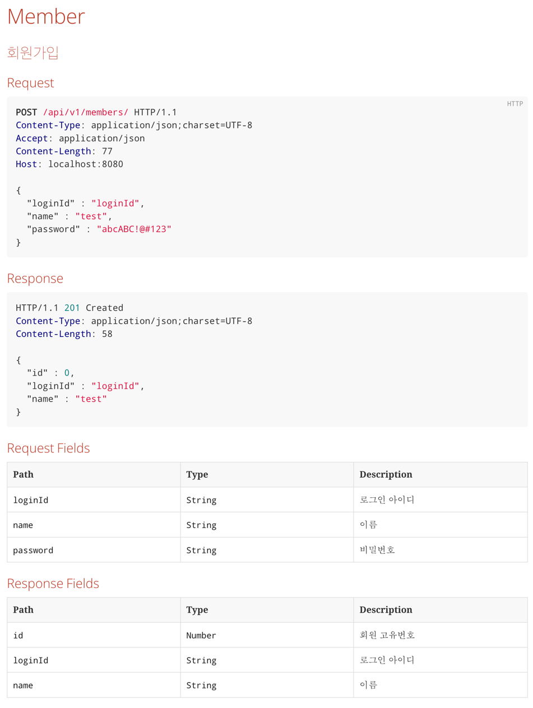
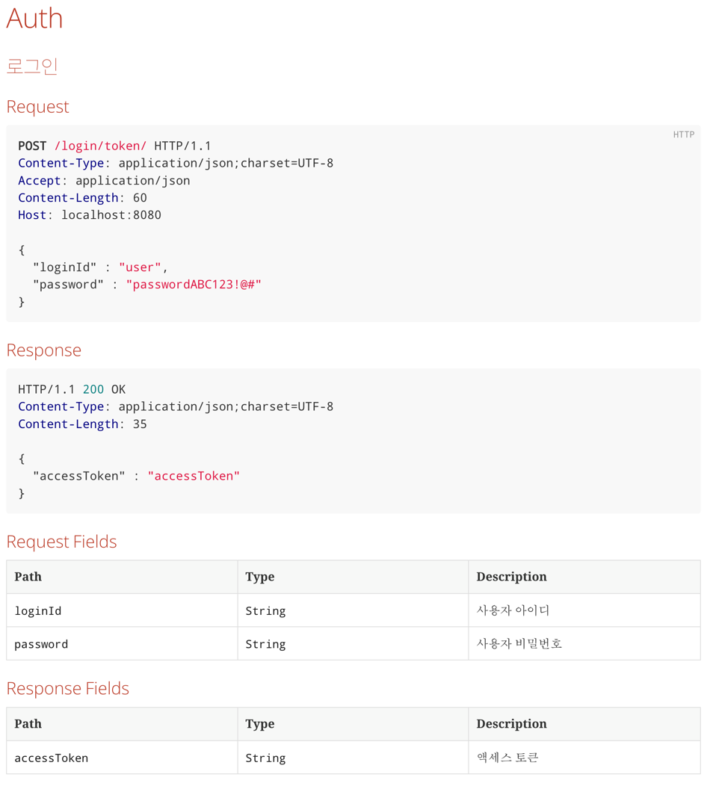
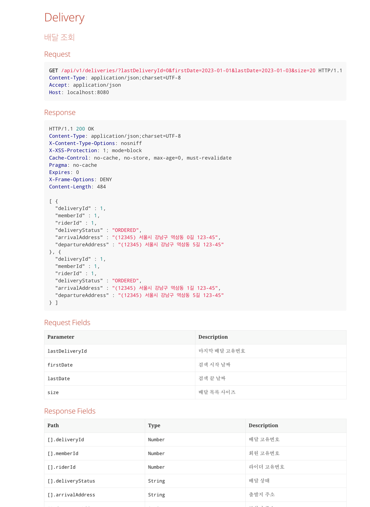

# 배달파트 Back-end(Java) 실무 과제

## 요구사항
1. 회원가입 API 구현
2. 로그인 API 구현
3. 배달 조회 API 구현
4. 배달 주문 수정 API 구현

## 적용 기술
- Java 11
- Spring Boot 2.7.9
- Spring Data JPA
- querydsl
- H2 Database
- Spring Security
- JWT
- rest docs

## 실행 방법
```
$ git clone https://github.com/yunbaek/barogo-delivery.git {project-folder}
$ cd {project-folder}
$ ./gradlew clean build
$ java -jar build/libs/barogo-delivery-0.0.1-SNAPSHOT.jar
```

## 개발 내역
### 1. 회원가입 API 구현
#### 기능 설명
- 사용자는 회원 가입을 할 수 있다. 
- 회원 가입에 필요한 정보는 `로그인 아이디, 이름, 비밀번호`이다.
- 모든 정보는 필수이다.
- 비밀번호는 소문자, 대문자, 숫자, 특수문자 중 3개 이상을 포함한 12개 이상의 문자열이다.
- 로그인 아이디는 중복될 수 없다.
- 누락된 정보가 있을 경우 회원 가입에 실패한다.
- 비밀번호 정책에 맞지 않을 경우 회원 가입에 실패한다.

#### 인수 조건
```text
Feature: 회원 가입
  Scenario: 회원 가입 성공
    Given 회원 가입 정보 입력
    When 회원 가입 요청
    Then 회원 가입 성공 응답
    
  Scenario: 회원 가입 실패
    Given: 이미 존재하는 회원 정보 입력
    When: 회원 가입 요청
    Then: 회원 가입 실패 응답
 
  Scenario: 회원 가입 실패
    Given: 요구사항에 맞지 않는 회원 정보 입력
    When: 회원 가입 요청
    Then: 회원 가입 실패 응답
```
- API 명세서 (rest docs - [localhost:8080/docs/members.html](localhost:8080/docs/members.html))


### 2. 로그인
#### 기능 설명
- 사용자는 기존 회원가입한 정보를 통해 로그인을 할 수 있다.
- 로그인에 필요한 정보는 `로그인 아이디, 비밀번호`이다.
- 모든 정보는 필수이다.
- 누락된 정보가 있을 경우 로그인에 실패한다.
- 모든 정보가 일치할 경우 로그인에 성공한다.
- 로그인에 성공하면 `JWT 토큰`을 발급한다.
- 모든 정보가 일치하지 않을 경우 로그인에 실패한다.
- 로그인에 실패하면 `401 Unauthorized`를 반환한다.
#### 인수 조건
```text
Feature: 로그인
  Scenario: 로그인 성공
    Given: 회원 등록되어 있음
    When: 로그인 요청
    Then: 로그인 성공 응답

  Scenario: 로그인 실패
    Given: 존재하지 않은 회원정보
    When: 로그인 요청
    Then: 로그인 실패 응답

  Scenario: 로그인 실패
    Given: 회원 등록되어 있음
    And: 비밀번호가 틀린 회원정보
    When: 로그인 요청
    Then: 로그인 실패 응답

  Scenario: 로그인 실패
    Given: 유효하지 않은 토큰 정보
    When: 로그인 요청
    Then: 로그인 실패 응답
```

#### 요청 / 응답
- API 명세서 (rest docs - [localhost:8080/docs/auth.html](localhost:8080/docs/auth.html))



### 3. 배달 조회
#### 기능 설명
- 로그인한 사용자는 배달 조회를 할 수 있다.
- 배달 조회에 필요한 정보는 `마지막 배달 아이디(No-offset paging 적용), 검색 시작 날짜, 검색 끝 날짜, 페이징 크기`이다.
- 페이징 크기의 기본값은 10이다.
- 마지막 배달 아이디가 없을 경우 가장 최근 배달을 조회한다.
- 검색 시작 날짜, 검색 끝 날짜가 없을 경우 오늘 날짜의 배달을 조회한다.
- 검색 날짜의 기간은 최대 3일이다.

#### 인수 조건
```text
Featrue: 배달 조회
  Scenario: 배달 조회 성공
    Given: 로그인한 사용자
    When: 배달 조회 요청
    Then: 배달 조회 성공 응답

  Scenario: 배달 조회 실패
    Given: 로그인하지 않은 사용자
    When: 배달 조회 요청
    Then: 배달 조회 실패 응답

  Scenario: 배달 조회 실패
    Given: 로그인한 사용자
    And: 검색 날짜의 기간이 3일을 초과
    When: 배달 조회 요청
    Then: 배달 조회 실패 응답
```

#### 요청 / 응답
- API 명세서 (rest docs - [localhost:8080/docs/deliveries.html](localhost:8080/docs/deliveries.html))



### 4. 배달 주소 변경
#### 기능 설명
- 로그인한 사용자는 배달 주소를 변경할 수 있다.
- 배달 주소 변경에 필요한 정보는 `배달 아이디, 변경할 배달 주소`이다.
- 배달 아이디는 필수이다.
- 변경할 배달 주소는 필수이다.
- 배달 아이디에 해당하는 배달이 없을 경우 배달 주소 변경에 실패한다.
- 배달 주소 변경에 성공하면 배달 주소 변경 이벤트를 발행한다. (미구현)
- 배달 주소 변경에 성공하면 배달 주소 변경 성공 응답을 반환한다.
- 배달 주소 변경에 실패하면 배달 주소 변경 실패 응답을 반환한다.

#### 인수 조건
```text
Feature:
    Scenario: 배달 주소 변경 성공
        Given: 로그인한 사용자
        When: 배달 주소 변경 요청
        Then: 배달 주소 변경 성공 응답
    
    Scenario: 배달 주소 변경 실패
        Given: 로그인하지 않은 사용자
        When: 배달 주소 변경 요청
        Then: 배달 주소 변경 실패 응답
    
    Scenario: 배달 주소 변경 실패
        Given: 로그인한 사용자
        And: 존재하지 않는 배달 아이디
        When: 배달 주소 변경 요청
        Then: 배달 주소 변경 실패 응답
```
#### 요청 / 응답
- API 명세서 (rest docs - 미구현)
- request
```http request
PUT /api/v1/deliveries/{deliveryId}
content-type: application/json; charset=UTF-8
accept: application/json

{
    "zipCode": "54321",
    "state": "서울",
    "city": "송파구",
    "street": "잠실동",
    "detail": "44444"
}
```

- response
```http request
HTTP/1.1 200
content-type: application/json
transfer-encoding: chunked
date: Mon, 6 Feb 2023 00:00:00 GMT
keep-alive: timeout=60
connection: keep-alive
```

## 미구현 사항
> 개발 계획에 있었으나 시간 부족으로 미구현된 사항입니다.

- redis 를 활용한 배달 조회 캐싱 기능
- 배달 조회, 수정 service 테스트 코드 작성
- 로그인 실패 예외 세분화, 테스트 코드 작성
- 배달 수정 시 `EventListener`를 활용한 배달 상태 변경 이벤트 발행 기능
- `docker-compose`를 활용한 개발 환경 구성
- 배포, 개발 환경 분리
- `AspectJ`를 활용한 로깅 기능 구현

